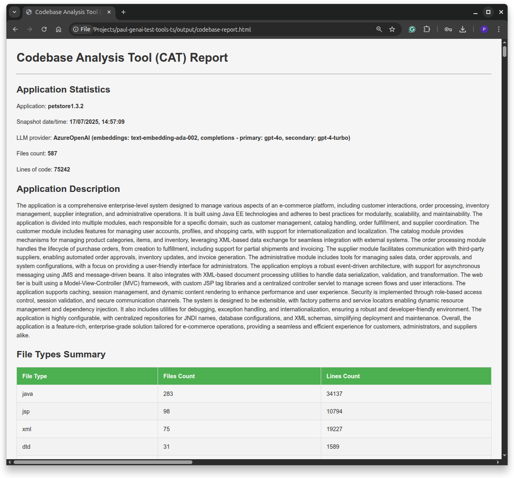
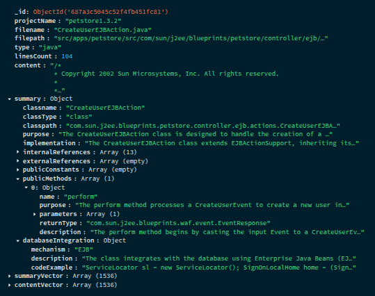

# Codebase Analyzer Tools - CAT

Tools to analyze and capture metadata from an existing application's codebase into a dataBASE and then derive higher-level insight about the application. The tools let you generate a report describing the application's purpose and composition. A tool is also provide to allow you to ask ad hoc questions of the codebase. Where applicable, the tools use one of a choice of several AI LLMs to help accelerate insight generation. The tools rely on the use a of MongoDB Atlas database (with its Vector Search capability) to store and retrieve insights.

The following screenshot shows part of an example report generated by these tools.



You can also [view an example of a full report generated](https://pkdone.github.io/codebase-analyzer-tool/example/codebase-report.html) by the tools.


## Prerequisites

1. Ensure you have the following software installed on your workstation:

    - [Node.js JavaScript runtime](https://nodejs.dev/en/download/package-manager/)
    - [`npm` package manager CLI](https://docs.npmjs.com/downloading-and-installing-node-js-and-npm)
    - [TypeScript npm package](https://www.npmjs.com/package/typescript)
  
1. Install the project's required Node/NPM packages. 

    ```console
    npm install
    ```

1. Ensure you have the codebase for a sample application ready to access on your local filesystem. You can optionally [download a zip of some example projects](https://drive.google.com/file/d/1rDSOiLOH0xq3Hc5k8i3DvZpCDVvDccr1/view?usp=sharing) for testing (for subset of people who have link access). Note the current version of these tools work better with Java-based codebases, but over time, many more programming languages will be supported equally.

1. Ensure you have can leverage LLMs from OpenAI/Azure GPT, GCP Vertex AI or AWS Bedrock API, with the following three models types available to use, along with appropriate LLM provider API keys / credentials:

    -  __Embeddings model__ for generating vector embeddings 
    -  __Text completions 'primaary' model, typically with a small token limit__ for generating text and JSON content to process text inputs 
    -  __Text completions 'secondary' model, typically with a large token limit__ for generating text and JSON content to process text inputs (acting as a backup in case the primary model errors for a particular piece of cotent)

    For suggestions on what LLM to run, see section [Demonstrated LLM Capabilities](#demonstrated-llm-capabilities)

1. In a shell, from the root folder of this project, run the following command to copy an example environment configuration file to a new file in the same root folder called `.env`:

    ```console
    cp 'EXAMPLE.env' '.env'
    ```

    Edit the `.env` file to:
    - Set your `LLM` provider (e.g., "OpenAI", "VertexAIGemini", etc.)
    - Set your MongoDB URL and codebase directory path
    - Set the specific environment variables required for your chosen LLM provider
    
    The system uses a **manifest-driven approach** - you only need to configure environment variables for your selected LLM provider. The application will automatically validate only the variables required for your chosen provider and provide clear error messages if any are missing. See the section [LLM Authentication And URN Notes](#llm-authentication-and-urn-notes) for help on determing the URNs for you to specify in the `.env` file.

1. Ensure you have a running MongoDB [Atlas](https://www.mongodb.com/atlas) version 7.0 or greater dedicated cluster of any size/tier. You can even use an 'M0' free-tier version, although for some uses cases, the free-tier storage limit of 512MB may be insufficient. Ensure the approprate network and database access rights are configured in Atlas.


## Easy Debugging

There are various tools you need to run in a specific order (shown the next section). For each tool, you can easily debug using VS Code, by following these steps:

1. Open the project in VS Code
1. In the _Explorer_ select the "src/cli/*.ts" file you want to run
1. From the _Activity Bar_ (left panel), select the _Run and Debug_ view
1. Execute the pre-configured task _Run and Debug TypeScript_
    - this will run the TypeScript compiler first, and then, if successful, it will run the program in debug mode, showing its output in the _Debug Console_ of the _Status Bar_ (bottom panel). 

Alternatively, you also run the `./dist/src/cli/c*.js` JavaScript files (first compiled from TypeScript using the `npm build` command) from the terminal using the `node` command. The command to run each tool is shown the next section.


## How To Run Main Tasks

(for a summary of the purpose of these tools, see the section [Analysis And Summary Capture Process](#analysis-and-summary-capture-process))

1. **BUILD THE PROJECT SOURCE CODE**: First build the project (this compiles TypeScript and moves some HTML template files to project's executable path) by executing the the following command.

    ```console
    npm run build
    ```


1. **CAPTURE SOURCES**: To capture LLM-generated metadata about every source file into the database, execute the the following commands from a terminal (or select the corresponding "src/cli/*.ts" file in your VS Code IDE and choose to "Run and Debug).

    ```console
    node ./dist/src/cli/1-capture-codebase.js
    ```

    Note 1. If you receive LLM provider authentication/authorisaton errors when you execute the task, see the section [LLM Authentication And URN Notes](#llm-authentication-and-urn-notes) for help on configuring LLM provider credentials correctly.

    Note 2. The task may take a few muinutes to tens of minutes to execute, depending on the complexity of the source project and the LLM used. This tool employs asynchronous IO and concurrency, but inevitably, the LLM will take time to respond to requests and may often apply throttling, which will be the main causes of slowdown. If you see messages with the character `?` in the tool's output, this indicates that the LLM is returning an "overloaded" response, and hence, the tool will transparently pause each affected LLM request job and then retry after a short wait.


1. **GENERATE INSIGHTS**: Run the following command to generate insights (e.g. identifid technology stack, business processes, DDD aggregates, potential microserices, etc.) lveraging the previously database captured sources files metadata.

    ```console
    node ./dist/src/cli/2-generate-insights-from-db.js
    ```

1. **CREATE REPORT**: Run the following command to generate a static HTML-based report summarising the application from the previously captured source metadata and aggregated insights. 

    ```console
    node ./dist/src/cli/3-create-report.js
    ```

## OPTIONAL: How To Run Optional Additional Tasks

1. **QUERY CODEBASE**: To adhoc query the codebase (i.e., to "talk to your code", which uses MongoDB's Vector Search capability to search the database-captured metadata), place your questions in the file `input/questions.prompts` and then run the following command to execute the queries. 

    ```console
    node ./dist/src/cli/query-codebase.js
    ```

1. **OTHER TOOLS**: You wil notice other tools are also provided in the "src/cli" folder which you can explore and run. These are currently undocumented and may disappear in the future. They are primarily intended for use by this project's developers.


## Running The Project's Full Build Process Including Unit And Integration Tests

Execute the following command from the project's root folder:

  ```console
  npm run validate
  ```


## LLM Authentication And URN Notes

During project setup, you will need to ensure you have enabled the required LLM for the requried cloud region using the cloud provider's LLM configuration tool.

### OpenAI / Azure GPT

Specify your API key for your own OpenAI or Azure GPT service in `.env`.


### GCP Vertex AI

Execute the following from shell, assuming you have already installed and configured the Google Cloud CLI (_gcloud_).

```console
gcloud auth login
gcloud auth application-default login
```

### AWS Bedrock

In the AWS Console, select the "Bedrock Configuration | Model Access" option and enable access for the models you requrie.

Execute the following from shell, assuming you have already installed and configured the AWS CLI, _aws_ (for a subset of people you can use MDB's SSO to access AWS account to obtain the SSO start URL):

```console
aws configure sso
```

Then edit the file `~/.aws/config` and rename the line `[profile ...]` for the newly generated profile section to `[default]` instead, then run:

``` console
aws sso login
aws sts get-caller-identity        # to test the CLI works
```

For some Bedrock hosted models, AWS forces you to use the ARN of an AWS "inference profile" for the particlar region for the model id. To view the region ARNs for models in Bedrock, run:

```console
aws bedrock list-inference-profiles
```

From this output, configure the URL defined for the `inferenceProfileArn` parameter in your `.env` file.


## Analysis And Summary Capture Process

The `capture-codebase` tool captures metadata about all the files in the codebase, including LLM-generated summary data, in a series of collections in the `codebase-analyzed` database. The main steps this tool conducts are:

1. Initialise database collections and indexes (including Atlas Vector Search indexes).

1. Loop through every nested file in the referenced codebase, capturing the following into the database collection `sources`:
    - the file's content (e.g., code)
    - the file's metadata (e.g., file type, filepath)
    - LLM-generated summary data for the specific file type (e.g., if the file is a Java source, captures information about the the class, including its public methods with signatures, other classes referenced by this class, etc.)
    - two separate vector embeddings, indexed via Atlas Vector Search (one for the file's content and one for the file's LLM-generated summary).
    
    Below is an example of a record stored in the database representing an introspected Java file:

    

Using captured metadata about the source files stored in the `sources` collection, the subsequent `generate-insights-from-db` tool uses an LLM to generate insights of various aspects of the application which it then persists into the database collection `appsummaries`. These captured insights include an outline of the application's purpose and a list its technologies, business processes, DDD bounded contexts, DDD aggregates, DDD entities,, DDD repositories, and potential microservices.


## Demonstrated LLM Capabilities

The following table shows the results of using this project with various LLMs against the codebase of the legacy [Sun/Oracle Java Petstore J2EE application](https://www.oracle.com/java/technologies/petstore-v1312.html) (tested on 17-July-2025):

| LLM Hosting/API Provider | LLMs | Insight Quality <sup>1</sup> | Speed <sup>2</sup> | Average Error Rate <sup>3</sup> |
| :---- | :---- | :---: | :---: | :---: |
| Azure OpenAI | GPT4o | 4 | 1:47 mins | 0.4 % |
| GCP VertexAI | Gemini 2.5 Pro \+ Flash | 5 | 13:44 mins | 0.6 % |
| AWS Bedrock | Claude Sonnet 4.0 & 3.7 | 4 | 23:47 mins | 1.1 % |
| AWS Bedrock | Amazon Nova Pro 1.0 Pro \+ Lite | 3.5 | 9:30 mins  | 0.8 % |
| AWS Bedrock | Meta Llama Instruct 3-3-70b \+ 2-90b  | 2 | 39:53 mins | 43 %  |
| AWS Bedrock | Mistral Large 2402 \+ 2407 | 2 | 15:12 mins | 24 % |
| AWS Bedrock | Deepseek R1 | 3.5 | 10:12 mins | 1 % |

1. **Insight Quality**: 1 - 5, 1 = Low, 5 = High

1. **Speed**: Time taken to extract insights from all source files incluing for waits/restries

1. **Error Rate**: Proportion of requests that the LLM could not process even after retries or where the prompt had to be truncated to fit the LLM's context window


## LLM Routing Abstraction

The `LLMRouter` class (see `src/llm/core/llm-router.ts`) enables the LLMs you use to be pluggable, Ut performs various tasks to optimize the use of the configured LLMs and their APIs, It abstracts away many of the undesirable non-functional behaviours which occur when using LLMs. These non-functional features include:

* **Pluggable LLM**.  Routes to flavour of LLM (which may have a speciifc token size limit).
* **Automatic LLM Timeouts**.  Proactively times out LLM invocations if the LLM is taking too long to respond.
* **Automatic LLM Retries**.  Detects throttling and timeout events from the LLM provider and automatically retries, several times, with pauses between each attempt.
* **Enforce JSON Response From LLM**.  Enforces a JSON format response, validated against a prescribed JSON schema, and automatically retries if a response is invalid JSON.
* **Automatically Fails Over To A Backup LLM**.  If the primary LLM's API response is consistently struggling to correctly process a particular prompt (e.g. repeated timeouts, repeated token limits exceeded, repeated JSON formatting issues), it automatically sends the request to a secondary LLM from the same family (if one has been specified).
* **Reactively Crop Excessively Large Prompt**.  If the LLM response error indicates the prompt is too large, it shortens the prompt to the size instructed by the LLM's API response, if specified. It otherwise, estimates the appropriate shorter size and applies that. Note, it only crops a prompt of it has been unable to fulfill the full prompt with the backup secondary LLM first, in case that has a larger accomodating limit.
* **Provide LLM Invocation Statistics**.  Gathers LLM invocation statistics (successes, failures, retries, truncations, etc.), logging each event and then providing a final summary table of LLM statistics at the end of the tool's run.
