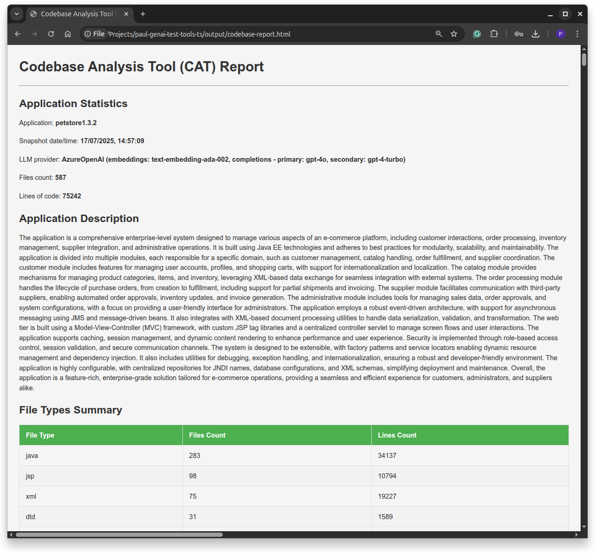
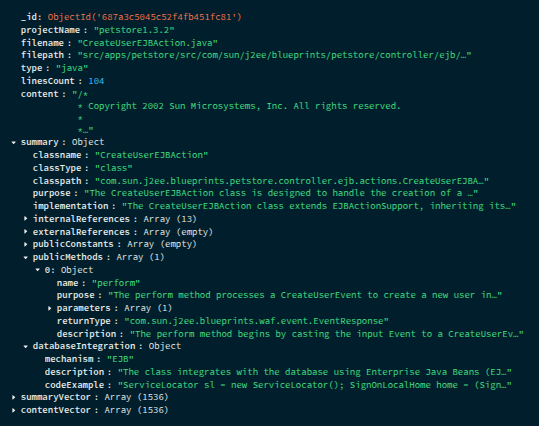

# Codebase Analyzer Tool - CAT

Set of tools to analyze and capture metadata from an existing application’s codebase into a database and then derive higher-level insight about the application. The tools let you generate a report describing the application’s purpose and composition. One of its tools also allows you to ask ad hoc questions of the codebase. Where applicable, the tools use one of several AI LLMs to generate insights. The tools rely on MongoDB Atlas to store and retrieve insights, and optionally use Atlas Vector Search to support ad hoc querying of the codebase.

The following screenshot shows part of an example report generated by these tools.



You can also view examples of full reports generated for various sample applications below:
- [Petstore App](https://pkdone.github.io/codebase-analyzer-tool/examples/petstore/codebase-report.html)
- [Legacy Banking App](https://pkdone.github.io/codebase-analyzer-tool/examples/bankingapp/codebase-report.html)
- [Fineract Banking App](https://pkdone.github.io/codebase-analyzer-tool/examples/fineract/codebase-report.html)


## Prerequisites

1. Ensure you have the following software installed on your workstation:

    - [Node.js JavaScript runtime](https://nodejs.dev/en/download/package-manager/) (version 20.0.0 or higher)
    - [`npm` package manager CLI](https://docs.npmjs.com/downloading-and-installing-node-js-and-npm)
    - [TypeScript npm package](https://www.npmjs.com/package/typescript)

    **Note:** To use the `cba` CLI globally, you'll need to ensure npm's global bin directory is in your shell's PATH. See the [CLI Usage](#cli-usage) section for setup instructions and troubleshooting.
  
1. Install the project's required Node/NPM packages. 

    ```console
    npm install
    ```

1. Ensure you have the codebase for a sample application available on your local filesystem. If the application's source spans multiple directories (e.g., application code in one directory and stored procedures in another), note the path to each directory. You can optionally [download a zip of some example projects](https://drive.google.com/file/d/1rDSOiLOH0xq3Hc5k8i3DvZpCDVvDccr1/view?usp=sharing) for testing (for a subset of people who have link access). 

1. Ensure you can leverage LLMs from OpenAI/Azure GPT, GCP Vertex AI or AWS Bedrock API, with at least one of embeddings model and at least one completions model available to use, along with appropriate LLM provider API keys / credentials:

    -  __Embeddings models__ for generating vector embeddings 
    -  __Text completions models__ for generating text and JSON content from source code

    For suggestions on what LLM to run, see section [Demonstrated LLM Capabilities](#demonstrated-llm-capabilities)

1. In a shell, from the root folder of this project, run the following command to copy an example environment configuration file to a new file in the same root folder called `.env`:

    ```console
    cp '.env.example' '.env'
    ```

    Edit the `.env` file to:
    - Set your `LLM_COMPLETION_MODEL_CHAIN` to be the chain (comma-separated list) of one or model keys (e.g., "vertexai-gemini-3-pro,bedrock-claude-opus-4.6")
    - Set your `LLM_EMBEDDING_MODEL_CHAIN` to be the chain (comma-separated list) of one or model keys (e.g., "vertexai-gemini-embedding-001")
    - Set your MongoDB URL and codebase directory path(s) via `CODEBASE_DIR_PATHS` (supports a single path or multiple comma-separated paths for projects with source in separate directories, e.g., application code and stored procedures)
    - Optionally set `PROJECT_NAME` to override the default project name (which is derived from the first directory in `CODEBASE_DIR_PATHS`)
    - Set the specific environment variables required for your chosen LLM providers
    
    The system uses a **manifest-driven approach** - you only need to configure environment variables for your selected LLM provider. The application will automatically validate only the variables required for your chosen provider and provide clear error messages if any are missing. See the section [LLM Authentication And URN Notes](#llm-authentication-and-urn-notes) for help on determining the URNs for you to specify in the `.env` file.

1. Ensure you have a running MongoDB [Atlas](https://www.mongodb.com/atlas) version 7.0 or greater dedicated cluster of any size/tier. You can even use an 'M0' free-tier version, although for some uses cases, the free-tier storage limit of 512MB may be insufficient. Ensure the appropriate network and database access rights are configured in Atlas.


## Development and Debugging

The primary interface for running tasks is the codebase analyze CLI, `cba` (see the next section), which also enables the tools to be easily exposed to AI Agents via skills. However, for development and debugging purposes, you can also run task files directly using VS Code or Node.js.

### VS Code Debugging

1. Open the project in VS Code
1. In the _Explorer_ select the `src/app/*.ts` or `src/app/tools/*.ts` file you want to run
1. From the _Activity Bar_ (left panel), select the _Run and Debug_ view
1. Execute the pre-configured task _Run and Debug TypeScript_
    - This will run the TypeScript compiler first (and copy some EJB templates to `dist/`), and then, if successful, it will run the program in debug mode, showing its output in the _Debug Console_ of the _Status Bar_ (bottom panel).


## CLI Usage

All tasks are available through the `cba` CLI. First build the project and link the CLI:

```console
npm run build
npm link
```

**Note:** On some systems, `npm link` may require elevated permissions. If you get a permissions error, try `sudo npm link` (Linux/macOS) or run your terminal as Administrator (Windows). Also, once you've successfully run `npm link` once, there is no need to run it again after every subsequent build.

The `npm link` step only needs to be run once. After that, `cba` is available as a direct command.

### Troubleshooting: `cba` command not found

If you get a "command not found" error after running `npm link`, npm's global bin directory is not in your shell's PATH. Here's how to fix this:

**1. Find your npm global bin directory:**
```console
npm config get prefix
```

**2. Add the bin directory to your PATH:**

The directory to add is `<prefix>/bin` (or `<prefix>` on Windows).

- **Bash** (Linux/macOS - `~/.bashrc` or `~/.bash_profile`):
  ```bash
  export PATH="$PATH:$(npm config get prefix)/bin"
  ```
  Then run: `source ~/.bashrc` (or `source ~/.bash_profile`)

- **Zsh** (macOS default - `~/.zshrc`):
  ```zsh
  export PATH="$PATH:$(npm config get prefix)/bin"
  ```
  Then run: `source ~/.zshrc`

- **Fish** (`~/.config/fish/config.fish`):
  ```fish
  fish_add_path (npm config get prefix)/bin
  ```
  Then run: `source ~/.config/fish/config.fish`

- **Windows PowerShell**:
  ```powershell
  $env:Path += ";$(npm config get prefix)"
  ```
  For permanent changes, use System Environment Variables settings.

**3. Verify installation:**
```console
cba --help
```

**Alternative: Run without PATH configuration**

If you prefer not to modify your PATH, you can run commands using the npm script (note the `--` to pass arguments):
```console
npm run cba -- pipeline
npm run cba -- capture
npm run cba -- --help
```

### Available Commands

| Command | Description |
|---------|-------------|
| `cba capture` | Capture LLM-generated metadata for every source file into the database |
| `cba insights` | Generate insights (tech stack, DDD aggregates, etc.) from database-captured sources |
| `cba insights-files` | Generate insights directly from source files (bypasses database) |
| `cba report` | Generate a static HTML report from captured metadata and insights |
| `cba query` | Query the codebase using MongoDB Atlas Vector Search |
| `cba projects` | List all projects stored in the database with summary statistics |
| `cba delete <project-name>` | Delete a project and all its data (sources and insights) from the database |
| `cba pipeline` | Run the full workflow: capture → insights → report |
| `cba models` | List all available LLM models for completions and embeddings |
| `cba test-mdb` | Test the MongoDB connection |
| `cba test-llm` | Test configured LLM providers |

Run `cba --help` for the full list of commands, or `cba <command> --help` for details on a specific command.

### Typical Workflow

You can run the full workflow with a single command:

```console
npm run build
cba pipeline
```

Or run each step individually:

```console
npm run build
cba capture
cba insights
cba report
```

**Note:** If the `cba` command is not found, see the troubleshooting section above to configure your PATH, or use the alternative approach: `npm run cba -- pipeline`.

Note 1. If you receive LLM provider authentication/authorisation errors when you execute a task, see the section [LLM Authentication And URN Notes](#llm-authentication-and-urn-notes) for help on configuring LLM provider credentials correctly.

Note 2. The `capture` task may take a few minutes to tens of minutes to execute, depending on the complexity of the source project and the LLM used. This tool employs asynchronous IO and concurrency, but inevitably, the LLM will take time to respond to requests and may often apply throttling, which will be the main causes of slowdown. If you see messages with the character `?` in the tool's output, this indicates that the LLM is returning an "overloaded" response, and hence, the tool will transparently pause each affected LLM request job and then retry after a short wait period.


### Alternative: Running Task Files Directly

For advanced debugging scenarios, you can bypass the CLI and run the compiled JavaScript task files directly using Node.js:

```console
node ./dist/src/app/capture-codebase.js
node ./dist/src/app/generate-insights-from-db.js
node ./dist/src/app/produce-report.js
node ./dist/src/app/tools/query-codebase.js
node ./dist/src/app/tools/list-available-models.js
```

**Note:** These are thin wrapper files that delegate to the same task implementations used by the CLI. The `cba` CLI is the recommended interface for normal usage.


## Running The Project's Full Build Process Including Unit And Integration Tests

Execute the following command from the project's root folder:

  ```console
  npm run validate
  ```


## LLM Authentication And URN Notes

During project setup, you will need to ensure you have enabled the required LLM for the required cloud region using the cloud provider's LLM configuration tool.

### OpenAI / Azure GPT

Specify your API key for your own OpenAI or Azure GPT service in `.env`.


### GCP Vertex AI

For 3rd-party (e.g. not Gemini) LLMs, such as Claude LLMs, the model needs to be Enabled first - in the GCP Console, go to "Model Garden" and enable access for the "Partner" models you require.

Execute the following from shell, assuming you have already installed and configured the Google Cloud CLI (_gcloud_).

```console
gcloud auth login
gcloud auth application-default login
```

### AWS Bedrock

In the AWS Console, select the "Bedrock Configuration | Model Access" option and enable access for the models you require.

Execute the following from shell, assuming you have already installed and configured the AWS CLI, _aws_ (for a subset of people you can use MDB's SSO to access AWS account to obtain the SSO start URL):

```console
aws configure sso
```

Then edit the file `~/.aws/config` and rename the line `[profile ...]` for the newly generated profile section to `[default]` instead, then run:

``` console
aws sso login
aws sts get-caller-identity        # to test the CLI works
```

For some Bedrock hosted models, AWS forces you to use the ARN of an AWS "inference profile" for the particular region for the model id. To view the region ARNs for models in Bedrock, run:

```console
aws bedrock list-inference-profiles
```

From this output, configure the URL defined for the `inferenceProfileArn` parameter in your `.env` file.


## Analysis And Summary Capture Process

The `capture-codebase` tool captures metadata about all the files in the codebase, including LLM-generated summary data, in a series of collections in the `codebase-analyzed` database. When multiple codebase directories are configured (via comma-separated paths in `CODEBASE_DIR_PATHS`), files from each directory are captured together as a single project, with file paths prefixed by each directory's name to distinguish their origin (e.g., `app-source/src/Main.java`, `stored-procs/dbo/sp_getUser.sql`). The main steps this tool conducts are:

1. Initialise database collections and indexes (including Atlas Vector Search indexes).

1. Loop through every nested file in the referenced codebase directories, capturing the following into the database collection `sources`:
    - the file's content (e.g., code)
    - the file's metadata (e.g., file type, filepath)
    - LLM-generated summary data for the specific file type (e.g., if the file is a Java source, it captures information about the class, including its public methods with signatures, other classes referenced by this class, etc.)
    - two separate vector embeddings, indexed via Atlas Vector Search (one for the file's content and one for the file's LLM-generated summary).
    
    Below is an example of a record stored in the database representing an introspected Java file:

    

Using metadata captured from the source files in the `sources` collection, the subsequent `generate-insights-from-db` tool uses an LLM to generate insights into various aspects of the application, which it then persists in the `appsummaries` database collection. These captured insights include an outline of the application's purpose and a list of its technologies, business processes, DDD bounded contexts, DDD aggregates, DDD entities, DDD repositories, and potential microservices.


## Demonstrated LLM Capabilities

The following table shows historical results from using this project with various LLMs against the codebase of the legacy [Sun/Oracle Java Petstore J2EE application](https://www.oracle.com/java/technologies/petstore-v1312.html). **Note:** This data is from July 2025 testing, and many models have evolved since then. For the current list of supported models, run `cba models` or see [.env.example](.env.example).

| LLM Hosting/API Provider | LLMs | Insight Quality <sup>1</sup> | Speed <sup>2</sup> | Average Error Rate <sup>3</sup> |
| :---- | :---- | :---: | :---: | :---: |
| Azure OpenAI | GPT4o | 4 | 1:47 mins | 0.4 % |
| GCP VertexAI | Gemini 2.5 Pro \+ Flash | 5 | 13:44 mins | 0.6 % |
| AWS Bedrock | Claude Sonnet 4.0 & 3.7 | 4 | 23:47 mins | 1.1 % |
| AWS Bedrock | Amazon Nova Pro 1.0 Pro \+ Lite | 3.5 | 9:30 mins  | 0.8 % |
| AWS Bedrock | Meta Llama Instruct 3-3-70b \+ 2-90b  | 2 | 39:53 mins | 43 %  |
| AWS Bedrock | Mistral Large 2402 \+ 2407 | 2 | 15:12 mins | 24 % |
| AWS Bedrock | Deepseek R1 | 3.5 | 10:12 mins | 1 % |

1. **Insight Quality**: 1 - 5, 1 = Low, 5 = High

1. **Speed**: Time taken to extract insights from all source files, including waits/retries

1. **Error Rate**: Proportion of requests that the LLM could not process, even after retries, or where the prompt had to be truncated to fit the LLM's context window


## LLM Routing Abstraction

The `LLMRouter` class (see `src/common/llm/llm-router.ts`) enables the LLMs you use to be pluggable. It performs various tasks to optimize the use of the configured LLMs and their APIs. It abstracts away many of the undesirable non-functional behaviours that occur when using LLMs. These non-functional features include:

* **User-Configured LLM Chain**.  Routes to the user-specified chain of LLMs, each with potentially different capabilities and token limits.
* **Automatic LLM Timeouts**.  Proactively times out LLM invocations when the LLM takes too long to respond.
* **Automatic LLM Retries**.  Detects throttling and timeout events from the LLM provider and then automatically retries several times, with pauses between each attempt.
* **Enforce JSON Response From LLM**.  Enforces a JSON format response, validated against a prescribed JSON schema, and automatically retries if a response is invalid JSON.
* **Automatically Fails Over To A Backup LLM**.  If the first LLM in the chain's API response is consistently struggling to correctly process a particular prompt (e.g., repeated timeouts, repeated token limits exceeded, repeated JSON formatting issues), it automatically sends the request to the next LLM in the chain (if one has been specified), and so on.
* **Reactively Crop Excessively Large Prompt**.  If the LLM response error indicates the prompt is too large, it shortens the prompt to the size instructed by the LLM’s API response, if specified. Otherwise, it estimates the appropriate shorter size and applies that. Note that it only crops a prompt if it has been unable to fulfill the full prompt with any of the other LLMs in the declared LLM chain first (if any), in case those LLMs have a larger accommodating token limit. Therefore, the cropping will only occur on the last LLM in the chain that was tried.
* **Provide LLM Invocation Statistics**.  Gathers LLM invocation statistics (successes, failures, retries, truncations, etc.), logging each event and then providing a final summary table of LLM statistics at the end of the tool's run.
